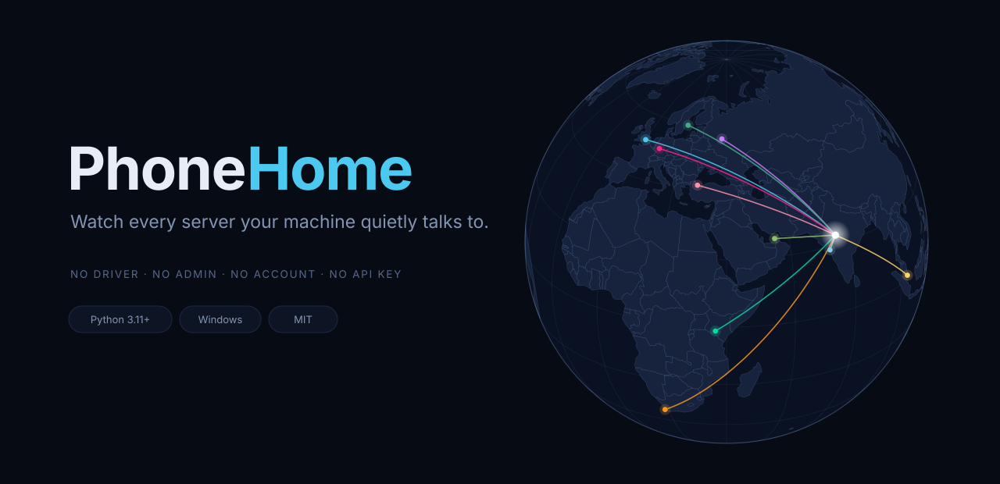

<p align="center">
  
</p>

<p align="center">
  
  
  
  
  
</p>

<p align="center"><b>
  Your laptop is never idle.<br>
  Open this and watch it talk — live, on a globe, with the program responsible for every line.
</b></p>

<br>

```powershell
pip install -r requirements.txt
python -m phonehome
```

A browser opens. Within seconds you are looking at every server your machine is
currently reaching, where each one is, and which program opened it.

**No packet capture. No kernel driver. No administrator. No account. No API key.**

<br>

---

## What you actually see

Sit still and do nothing, and it still fills up. A genuinely idle Windows laptop,
one minute in:

| Process | Talking to | Where |
|---|---|---|
| `SpotifyLauncher.exe` | `gae2-dealer.g2.spotify.com` | Montreal, Canada |
| `svchost.exe` | `2603:1040:a06:6::1` | Pune, India |
| `BackgroundDownload.exe` | `mobile.events.data.microsoft.com` | Paris, France |
| `SupportAssistAgent.exe` | `13.78.109.163` | Tokyo, Japan |
| `brave.exe` | `update.googleapis.com` | Delhi, India |

Five countries, nobody touching the keyboard.

<!--
  Drop a recorded GIF in here and it goes right at the top of the page.
  ShareX or ScreenToGif -> record the globe for ~10s -> save as docs/demo.gif:

  <p align="center"></p>
-->

## Features

- **Live globe.** Every open connection is a dot tethered to you, drawn with real
  great-circle geometry. New connections flare bright, then settle into a standing link.
- **Blame by process.** Every connection carries the program that opened it. Click a
  process in the sidebar to isolate it.
- **Drag to spin, scroll to zoom.** Zoom redraws vectors, so it gets sharper, and the
  point under your cursor stays under your cursor.
- **Session report.** One click: top talkers, most-contacted hosts, countries, and the
  tail of destinations contacted exactly once — where telemetry and update pings live.
- **Runs on nothing.** ~1,100 lines of Python and one HTML file. Five dependencies.

## How it works

The interesting part is what it *doesn't* do. Tools in this space usually install a
packet-capture driver and demand administrator rights. None of that is necessary to
answer "who is my machine talking to".

| Question | Answer | Cost |
|---|---|---|
| Which connections are open? | `psutil.net_connections()` — wraps Windows' own `GetExtendedTcpTable`, which hands an unelevated process the remote address **and the owning PID** | free, no driver |
| What is that program called? | `psutil.Process(pid).name()` | free |
| What is that address called? | `Get-DnsClientCache` — Windows already remembers which name resolved to which address, so no lookups of our own | free, instant |
| Where is it? | ip-api.com, falling back to ipwho.is, cached permanently in SQLite | free |

Every address is geolocated **once, ever**. A normal session makes one or two API
calls, and that is the only point at which anything leaves the machine.

ip-api is HTTP-only and some ISPs blackhole it; on two failures the app switches
provider and **records that decision on disk**, so later launches skip the dead host
instead of stalling on it — 9.0s down to 0.7s to locate yourself. It re-probes after
six hours.

## Honest limitations

Every tool has these. Most READMEs hide them.

- **Windows only.** The connection table and the DNS cache are both Win32.
- **Roughly a third of destinations resolve to a hostname.** Browsers and Electron
  apps use DNS-over-HTTPS, so their lookups never touch the Windows resolver and leave
  nothing to read. Those show as bare IPs rather than an invented name.
- **Connections are sampled once a second.** Something that opens and closes inside
  that window is missed. Catching those requires packet capture, a driver, and admin —
  the exact trade this project declines to make.
- **City-level geography is approximate.** Free geolocation places the CDN edge node,
  not the machine behind it.
- **Names for protected system processes need elevation.** Their traffic is still
  counted; only the label is lost.

## Verifying it

`docs/TESTING.md` has 35 numbered checks, from the private-address filter through to
tooltip placement. The self-check needs no server and no network:

```powershell
python -m phonehome demo
```

```
  ok  is_public rejects 17, keeps 4
  ok  live snapshot: 22 connections, all public, no duplicates
  ok  DNS parser: skips CNAMEs, blanks, junk; handles single-row JSON
  ok  geo cache: persists, negative-caches, never re-queues known IPs
  ok  both geo providers normalise to an identical record
  ok  failover verdict persists, expires, and survives junk markers
  ok  Get-DnsClientCache returned 100 usable rows
```

That first line matters more than it looks. `ipaddress.is_private` returns **False**
for `100.64.0.0/10`, the carrier-grade NAT range — so the obvious filter leaks your
ISP's internal infrastructure onto the map as though it were a foreign server. The
correct test is `is_global and not is_multicast`.

## Options

| Flag | Effect |
|---|---|
| `--port 8010` | Serve somewhere other than 8000 |
| `--no-browser` | Don't open a browser tab |
| `demo` | Run the self-checks and exit |

## Layout

```
phonehome/
├── server.py      poll loop, delta diffing, HTTP + WebSocket, self-checks
├── geo.py         address classification, geolocation, SQLite cache, failover
├── dns_cache.py   Windows DNS cache -> {ip: hostname}
├── ws_probe.py    terminal client for the live stream
└── static/
    └── index.html the globe: canvas rendering, arcs, sidebar, report
```

## Built with

[D3](https://d3js.org) (ISC) for projection and geometry, [TopoJSON](https://github.com/topojson/topojson-client)
(BSD-3) for the world outlines, boundaries from [Natural Earth](https://www.naturalearthdata.com)
(public domain), and [psutil](https://github.com/giampaolo/psutil) (BSD-3) for the
connection table. Geolocation by [ip-api.com](https://ip-api.com) and
[ipwho.is](https://ipwho.is) — both free tiers, **non-commercial use only**.

## License

MIT — see [LICENSE](LICENSE).
